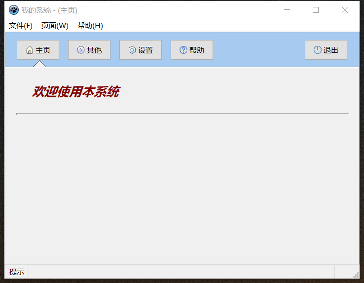
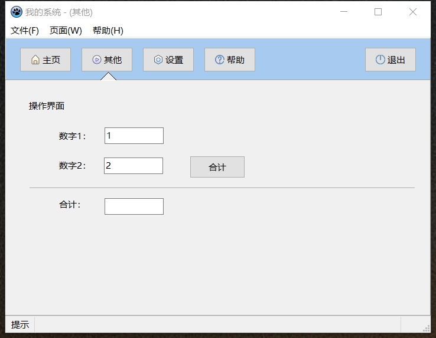
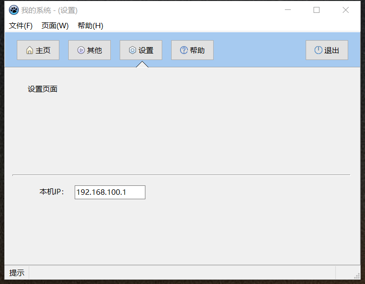
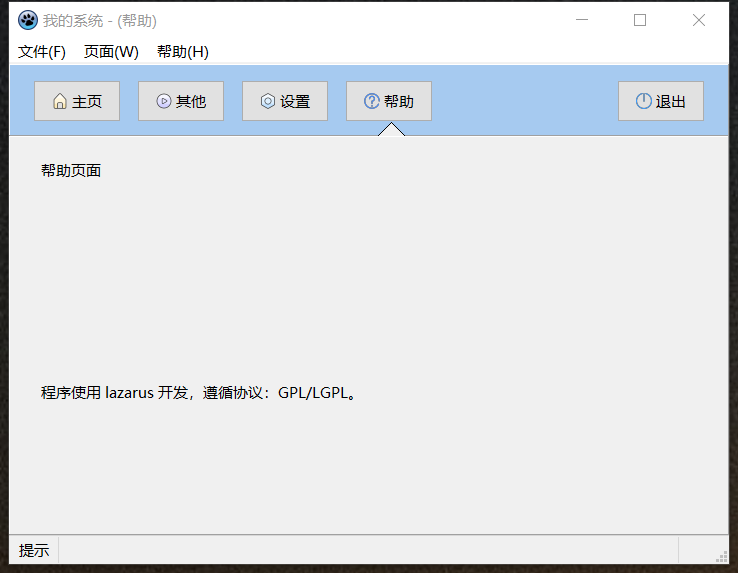
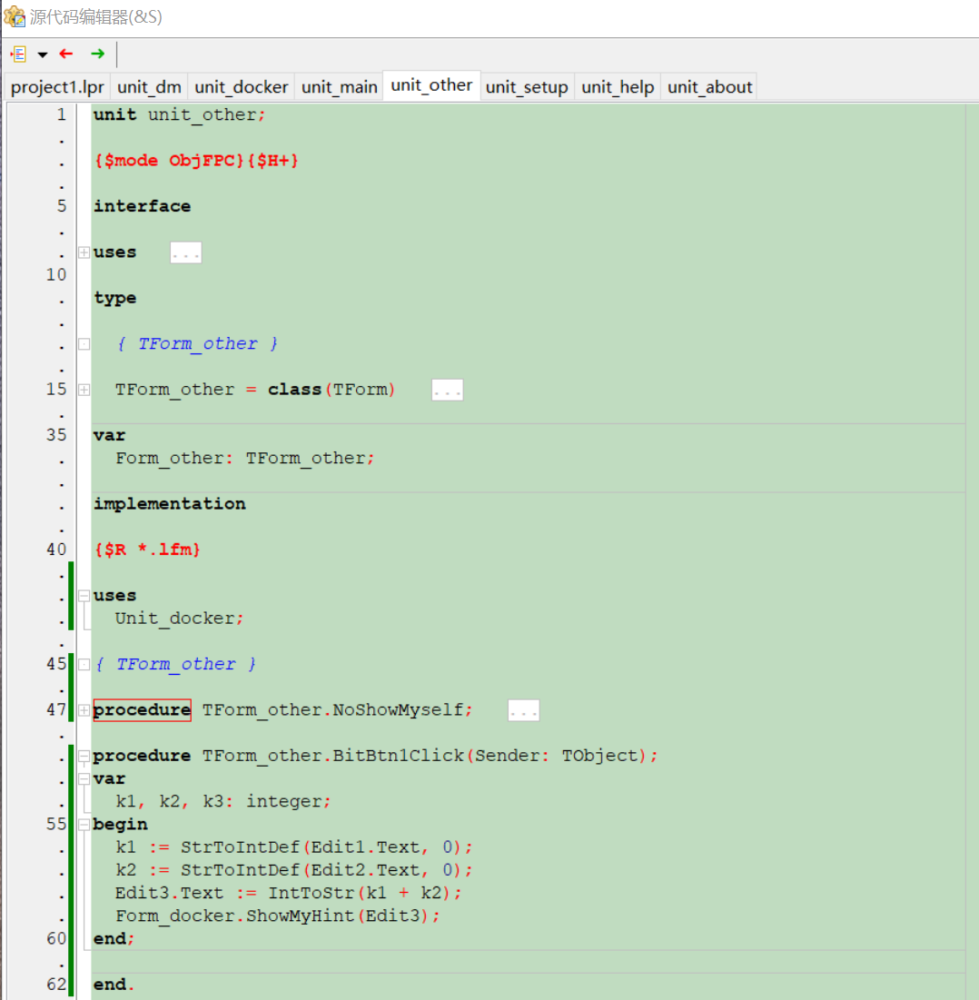

# laz-demo1

#### 介绍

使用 Lazarus 设计的通用程序界面。

_Lazarus 是兼容 Delphi 的跨平台集成开发工具（IDE），使用 Free Pascal 语言，有丰富的内置组件，也可在线安装第三方组件，组件面板神似 Delphi，除了 Win32，还可以使用 GTK、Qt、AWTK 等跨平台 GUI 框架，对于一个 Delphi 程序员来说，可以轻松上手 Lazarus，不同的是他是开源的！ (GPL/LGPL)_

- 本程序设计了 4 个页面窗口
- 可以用按键和菜单切换显示不同的页面窗口
- 每个窗口的代码在一个 unit 文件中，互不干扰
- 内置了一个闪烁显示提示的控件源码
- 详细说明请见代码内说明

#### 软件架构

文件目录结构：（代码 _.pas 窗体 _.lfm）

- project1.lpi // 项目文件
- unit_dm.pas // 数据模式文件
- unit_docker.pas // 主窗口
- unit_help.pas // 帮助
- unit_main.pas // 主页
- unit_other.pas // 操作
- unit_setup.pas // 设置
- unit_about.pas // 关于

#### 使用说明

1.  下载安装 lazarus (V3.4 FPC_3.2.2)
2.  下载本程序 (未使用其他特殊控件包)
3.  打开本项目，编译，运行。

#### 联系作者

88185785@qq.com
